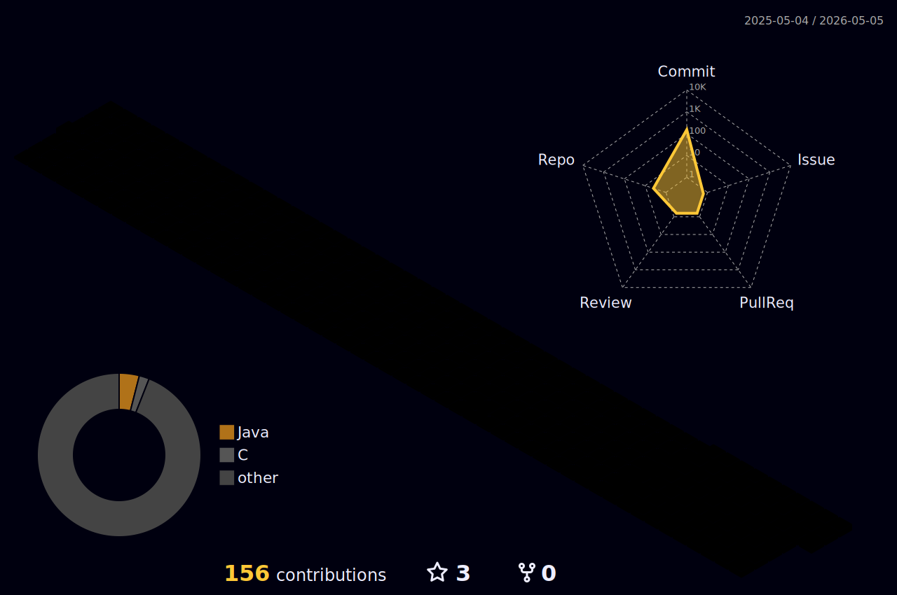

<!-- ===================================== -->
<!-- 🌟 ANIMATED HEADER -->
<!-- ===================================== -->

<h1 align="center">
  
</h1>

  

<b>💻 Java & OOP | 🚀 Problem Solving | 📊 DSA | 🎯 Project Building</b>

<!-- ===================================== -->
<!-- 👨‍💻 ABOUT ME -->
<!-- ===================================== -->

<h2 align="center">👨‍💻 About Me</h2>

- 🎓 CSE Student (Bangladesh)  
- 🧠 Focused on **OOP, DSA, Problem Solving**  
- 💻 Mainly working with **Java** (also learning databases & backend basics)  
- 🚀 Building projects step-by-step to become **job/internship ready**  
- 📫 Email: **your-email-here**  

 

<!-- ===================================== -->
<!-- 🧰 TECH STACK -->
<!-- ===================================== -->

<h2 align="center">🧰 Tech Stack</h2>

### 💻 Languages

  
  
  
  
  

### 🗄️ Database & Backend (Learning/Using)

  
  
  
  

### ⚙️ Tools

  
  
  
  
  
  

---

<!-- ===================================== -->
<!-- 📊 GITHUB ANALYTICS -->
<!-- ===================================== -->

<h2 align="center">📊 GitHub Analytics</h2>

  

  

---

<!-- ===================================== -->
<!-- 🧠 MOST USED LANGUAGE -->
<!-- ===================================== -->

<h2 align="center">🧠 Most Used Languages</h2>

  

---

<!-- ===================================== -->
<!-- 📈 3D CONTRIBUTION GRAPH -->
<!-- ===================================== -->

<h2 align="center">📊 3D Contribution Graph</h2>

  

---

<!-- ===================================== -->
<!-- 🧪 FEATURED PROJECTS -->
<!-- ===================================== -->

<h2 align="center">🧪 Featured Projects</h2>

🔹 **[Student Management System](https://github.com/SMTH20/YOUR_REPO_NAME)**  
Java + OOP based project (add DB/JDBC if used)  

🔹 **[Project 2 Title](https://github.com/SMTH20/YOUR_REPO_NAME)**  
One-line description of what it does  

🔹 **[Project 3 Title](https://github.com/SMTH20/YOUR_REPO_NAME)**  
One-line description of what it does  

---

<!-- ===================================== -->
<!-- 🏆 GITHUB ACHIEVEMENTS -->
<!-- ===================================== -->

<h2 align="center">🏆 GitHub Achievements</h2>

  

---

<!-- ===================================== -->
<!-- 🐍 CONTRIBUTION SNAKE -->
<!-- ===================================== -->

<h2 align="center">🐍 Contribution Snake</h2>

  

---

<!-- ===================================== -->
<!-- 🔗 CONNECT WITH ME -->
<!-- ===================================== -->

<h2 align="center">🔗 Connect With Me</h2>

  
  
  

